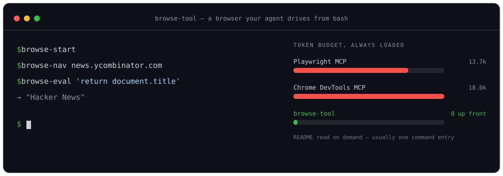
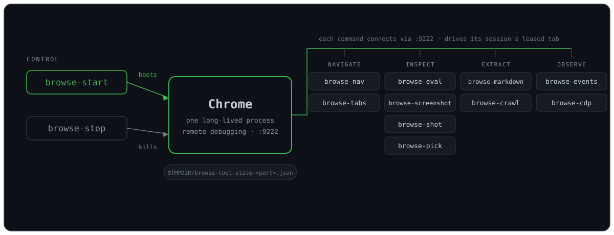

# browse-tool



Minimal Bash-invokable browser tools for coding agents. Twelve small CLI scripts drive a real Chrome — navigate, run JS, screenshot, scrape to markdown, crawl, stream CDP events — described in a few hundred tokens instead of the 13–18k an equivalent MCP loads up front. Agents lean on standard DOM/JS knowledge instead of memorizing tool schemas.

Inspired by Mario Zechner's [What if you don't need MCP at all?](https://mariozechner.at/posts/2025-11-02-what-if-you-dont-need-mcp/).

## Why not MCP?

- Playwright MCP ≈ 13.7k tokens of tool schema, always loaded.
- Chrome DevTools MCP ≈ 18.0k tokens.
- browse-tool ≈ a few hundred tokens, loaded only when the agent reads this README.
- Outputs pipe, save, and compose with ordinary shell tools.
- Adding a command is a single file — no protocol, no rebuild, no restart.

## Requirements

- Node.js ≥ 20
- Google Chrome, Chromium, or Chrome Canary installed (point `CHROME_PATH` at the binary if it isn't auto-detected)

## Install

```bash
git clone https://github.com/nino-chavez/browse-tool.git
cd browse-tool
npm install
```

Put the bins on your PATH — in `~/.zshrc`:

```bash
export PATH="$HOME/path/to/browse-tool/bin:$PATH"
```

Or launch Claude Code with the bins on PATH for one session (run from the repo root):

```bash
alias cl='PATH=$PWD/bin:$PATH claude'
```

Then `/add-dir <path-to-browse-tool>` in Claude Code so the agent can `@README.md` for reference.

## How it works

.json); browse-stop kills it. Every other command is a thin client that reads the state file for its port and drives its own leased tab in the same browser, grouped as NAVIGATE (browse-nav, browse-tabs), INSPECT (browse-eval, browse-screenshot, browse-shot, browse-pick), and EXTRACT (browse-markdown, browse-crawl)." width="100%">

`browse-start` launches one long-lived Chrome with remote debugging on `:9222` and records it in `$TMPDIR/browse-tool-state-<port>.json`. Every other command is a thin client: it reads the state file for its port (`BROWSE_PORT`, else 9222), connects to the same browser, and drives its own leased tab — so navigation, evaluation, screenshots, and scraping all share one persistent browser and one logged-in profile, while parallel sessions stay off each other's tabs. `browse-stop` kills the browser and clears the state.

## Commands

Every command below connects to the Chrome that `browse-start` launched (see [How it works](#how-it-works)).

### `browse-start [--profile] [--profile-name <name>] [--reseed] [--headless] [--port 9222]`
Launch Chrome with remote debugging. Profiles live persistently under `~/.browse-tool/profiles/<name>` so your logged-in state survives between sessions.

- **Default profile is `shared`** — one profile for every session, on every project. Override with `--profile-name foo` or `BROWSE_PROFILE=foo`.

  This used to default to the basename of the current working directory, which silently turned "where you happened to be" into an identity: every repo, worktree and audit scratch dir minted its own Chrome profile. That reached 102 profiles / 74 GB, five of which had each separately downloaded the same 4 GB on-device model. Sessions now share one browser and isolate at the **tab** level instead (see *Parallel sessions* below), so logging into a site once covers every project.

  **A separate profile is only warranted for simultaneous distinct authenticated identities on the same origin** — e.g. an admin account and a member account you need signed in at once. For a merely logged-out view, use `BROWSE_INCOGNITO=1` instead; it isolates cookies in a BrowserContext without a second profile on disk.
- **`--profile`** on first run rsyncs your real Chrome default profile (cookies, logins, extensions) into the target directory — **only when the target is empty**. Your real Chrome profile is never modified. On subsequent runs the flag is a no-op; the persistent profile is reused as-is.
- **`--reseed`** forces a fresh rsync over an existing profile (useful after you log into a new account in real Chrome). Refused on the `shared` profile while other sessions hold live tab leases — reseeding rewrites `Default/` and would change identity underneath them.

### Parallel sessions

Independent Claude and Codex sessions all drive **one** Chrome on one profile. Each session gets its own tab, leased by session id (`CLAUDE_CODE_SESSION_ID` / `CODEX_COMPANION_SESSION_ID`, else `BROWSE_SESSION`, else the parent pid). Leases are one file per session under `~/.browse-tool/leases/` — deliberately not the shared state file, since every `browse-*` command is a separate process and concurrent writes to one JSON would be a race.

This matters because the old behaviour picked "whichever page looks active", and two independent processes provably selected the *same* tab — so parallel sessions silently drove each other's browser.

- Cookies and logins are shared across sessions (same profile, same default context). That is the point: log in once.
- `BROWSE_INCOGNITO=1` gives the session an isolated BrowserContext — its own cookies and storage, no second profile on disk. A session holds one lease *per isolation mode*, so flipping the flag moves between your normal tab and your incognito tab and back, keeping both. (With a single lease it silently handed back whichever tab already existed — no isolation, no warning.)
- `BROWSE_SHARED_TAB=1` restores the old "active or first page" behaviour, for single-session use or driving a tab you opened by hand.
- `browse-nav --new` opens a tab *and* moves this session's lease onto it, so the following `browse-eval` / `browse-screenshot` reads the page you just navigated.
- `browse-stop` stops **only what holds its target port**, and clears only the leases pointing at that browser.
- **`--headless`** runs without a visible window.

### Ports: one browser per port, state keyed by port

State lives in `$TMPDIR/browse-tool-state-<port>.json`. The port is a browser's identity everywhere in this tool — `browse-start` refuses a held port, `browse-stop` kills the port's owner — so the record is keyed the same way.

A session on a non-default port must say so on every command. `--port` works on
every command, and `BROWSE_PORT` saves repeating it:

```bash
browse-start --port 9223
export BROWSE_PORT=9223   # browse-start prints this line for you

browse-nav --port 9223 example.com   # or per-command
```

Why it matters: state used to be one global `browse-tool-state.json`. The most recent `browse-start` anywhere on the machine overwrote it, so `browse-stop` in one session read *another* session's port **and** pid, found that pid legitimately owning that port, and killed it — with nothing to flag, while its own Chrome survived unrecorded holding a port for the next session to trip over.

A `BROWSE_PORT` or `--port` that does not parse is a hard error, never a fallback to 9222 — the default port is a browser other sessions may be using, so silently redirecting a typo there is the worst available response. `--port` with no value is rejected too: it arrives as boolean `true`, and `Number(true)` is a perfectly valid-looking `1`. `--port=9223` and `--port 9223` are equivalent; an exported-but-empty `BROWSE_PORT=` reads as absent, while `--port=` is an error.

Chrome permits one instance per profile. Because every session now defaults to the same `shared` profile, the usual answer to "already running" is to use the browser that exists rather than start a second one:

- If the port is held by a Chrome running **the profile you asked for**, `browse-start` adopts it — records it in state and exits 0. Leaving it unrecorded would strand a live browser with no state entry, which silently disables the wrong-browser check (it fails open on a null state). Adoption matches on profile, not mode, so it says so when the running browser is headless and you asked for headed (or the reverse). `--reseed` cannot be satisfied by adoption and is refused with a non-zero exit rather than reported as done.
- If the port is held by a **different** profile, it refuses and names the squatter.
- If the profile is open but on another port, it reads Chrome's `SingletonLock`, names the holding pid, and prints the `BROWSE_PORT` to use.

**Port ownership is verified, not assumed.** `browse-start` refuses to start when
something it does not track already holds the debugging port, and names the
squatter's pid and profile; after launching it confirms the port belongs to the
Chrome it just spawned. `browse-eval` and friends refuse to connect when the
port's owner is not the tracked pid. Fail-open: if `lsof` cannot answer, the
checks are skipped rather than blocking work.

Why this exists: the old code only checked that the recorded pid was *alive*,
never that it owned the port. A headless orphan from a finished session could
hold `9222` while `browse-start` reported success for a different profile, and
every subsequent command — navigation, screenshots, cookie reads — ran against
the orphan and succeeded. On 2026-08-02 that produced four false "logged out"
readings and cost an 8.4 GB profile clone deleted on a false negative. A silent
wrong-browser failure is worse than a loud refusal.

- **`--profile` cannot transplant a logged-in Facebook session.** Cookies copy
  fine, but `c_user`/`xs` are bound to the originating profile and Chrome drops
  them; only `datr` survives. Log into the automation profile directly instead.
  Chrome 136+ likewise refuses `--remote-debugging-port` on your real default
  profile, so driving your everyday browser is not an option either.

Parallel with real Chrome on macOS: browse-tool Chrome runs as its own process but macOS merges it with your real Chrome in the Dock (same app bundle). Use `Cmd+~` to cycle between their windows, or install Chromium / Chrome Canary and set `CHROME_PATH=/path/to/Chromium.app/Contents/MacOS/Chromium` for a truly separate Dock app.

### `browse-stop [--port <n>] [--force]`
Kill whatever holds the debugging port, then clear the state and the leases for
that browser. Exits non-zero if anything is still listening afterwards. Killing
only the tracked pid is how orphans accumulated: the kill failed with `ESRCH`,
the state file was deleted anyway, and a live headless Chrome kept the port for
the next session to trip over.

**Refuses while other sessions hold live leases on that browser.** A shared
browser is meant to outlive any one session, and this is the largest blast radius
in the tool — stopping it closes every session's tabs. `--force` overrides.

A lease records the port it belongs to. One written before that field existed is
attributed by asking the browser, over `/json/list`, whether it actually holds
that lease's tab — an exact answer rather than a guess. Only when the browser
cannot be asked does the lease count as a possible match and block. Both halves
matter: an earlier version compared ports exactly, matched none of the eight live
legacy leases, and killed the browser they were all using; the version after it
blocked on every port for the twelve hours until those leases went stale.

Presence is decided by `lsof` **or** a `/json/version` probe, not `lsof` alone.
`portOwners()` returns an empty list both for "nothing is listening" and for
"could not determine", and it is deliberately fail-open so it never blocks
ordinary work — gating a destructive guard on that alone points the fail-open the
wrong way. The probe checks for the DevTools payload, not just HTTP 200, so an
unrelated server on the port is not mistaken for a browser.

The probe does **not** cover the window where a Chrome has spawned but is not yet
listening — a TCP connect is refused then, so it reports absent exactly as `lsof`
does. That window is handled structurally instead: **leases are cleared only
after the port is confirmed released**, never merely because a `SIGTERM` was
sent. A signal accepted but not acted on within the grace period (hung renderer,
a modal blocking shutdown) leaves every lease intact and exits non-zero.

When nothing was stopped, only *your own* lease **for that port** is cleared —
not your leases generally. A `browse-stop --port 9333` that finds nothing must
not delete your live 9222 lease and orphan the tab you are working in.

If a browser answers but no owning process can be identified, nothing is stopped
and the run exits non-zero. `--force` does not help there — it overrides the
live-session guard, not the absence of a pid to signal.

### `browse-nav <url> [--new] [--wait]`
Navigate the active tab (or a new one with `--new`). `https://` is auto-prepended if the URL has no scheme. `--wait` waits for `networkidle2` instead of `domcontentloaded`. Prints final URL and title.

### `browse-eval '<js>'` | `browse-eval --file script.js` | `echo '…' | browse-eval --stdin`
Run JavaScript in the active page. Code is wrapped in `async () => { … }`, so use `return` for a value and `await` freely. Result is JSON-serialized to stdout. Prefer writing scripts to files for anything non-trivial.

Examples:
```bash
browse-eval 'return document.title'
browse-eval 'return [...document.querySelectorAll("h2")].map(h => h.innerText)'
browse-eval 'const r = await fetch("/api/me"); return r.status'
```

### `browse-screenshot [--full] [--out path.png]`
Capture the viewport (or full page with `--full`) as PNG. Prints the path so you can `Read` it.

### `browse-shot <url> [--out path.png] [--full] [--wait] [--wait-ms <n>] [--wait-for <selector>]`
Navigate to URL, wait for readiness, optionally wait for a selector or additional time, then screenshot in one command. Replaces the `browse-nav && sleep N && browse-screenshot` pattern. Prints the output path.

### `browse-markdown <url> [--wait] [--wait-ms <n>] [--wait-for <selector>] [--raw]`
Navigate to URL, strip nav/ads/boilerplate with Readability, convert the main content to markdown with Turndown. Prints `# title` + markdown body to stdout. Falls back to the full page body if Readability finds no article-shaped content (dashboards, SPAs, listings) — `--raw` skips Readability entirely and always converts the full body. Use this instead of `browse-eval 'return document.body.innerText'` when you want clean, LLM-ready text from an article/blog/docs page rather than raw eval output.

### `browse-crawl <start-url> [--depth N] [--include prefix] [--max N] [--out dir] [--wait]`
BFS crawl from `start-url`, following same-origin links (or links matching `--include prefix` for a narrower scope) up to `--depth` levels deep (default `1`: the start page plus its direct links), capped at `--max` pages total (default `20`). Each visited page is written as clean markdown (Readability + Turndown, same extraction as `browse-markdown`) to `--out dir` (default a fresh temp dir), plus a `manifest.json` listing `{url, title, file}` for every page. Prints each file path to stdout as it's written; prints the final page count and output dir to stderr. Visited URLs are deduped (fragment-stripped) so it never re-fetches a page.

### `browse-tabs [list | close <index|target-id> [--force]]`
List open tabs with their URL/title, or close one. `list` shows a short target id and marks ownership: `*` this session's tab, `~` another session's, blank unclaimed. `close` accepts a target id (or unique prefix) as well as an index — the id is stable, whereas indices renumber when any session opens or closes a tab between your `list` and your `close`. Closing a tab held by another live session is refused unless you pass `--force`.

### `browse-events [<Domain.event> | '<Domain.*>' ...] [--console] [--network] [--duration <sec>] [--count <n>] [--out <file>]`
Stream Chrome DevTools Protocol events from this session's tab as JSON lines (`{ts, event, params}`), one per line, to stdout or appended to `--out`. Use it to watch what a page actually does — console output, failing requests, navigation — while other commands (or a human) drive it.

- **`--console`** subscribes to `Runtime.consoleAPICalled`, `Runtime.exceptionThrown`, `Log.entryAdded`. **`--network`** to `Network.requestWillBeSent`, `Network.responseReceived`, `Network.loadingFailed`. With no events named you get both presets.
- Positional names subscribe to exact events (`Page.loadEventFired`) or a whole domain (`'Page.*'` — quote it, or the shell globs it). The needed `<Domain>.enable` calls are sent automatically.
- Runs until Ctrl-C by default; `--duration <sec>` or `--count <n>` bounds the run for scripted use. Typical agent pattern: start it in the background with `--out`, drive the page, then read the file.

```bash
browse-events --network --duration 15 --out /tmp/net.jsonl &
browse-nav https://example.com --wait
browse-eval 'document.querySelector("#checkout").click()'
wait; grep loadingFailed /tmp/net.jsonl
```

### `browse-cdp <Domain.method> ['<json-params>'] [--browser]`
Raw CDP passthrough: send any protocol method to this session's tab and print the JSON result. The escape hatch for anything the task-level commands don't cover — including methods Chrome shipped after this tool was written. `--browser` targets the browser instead of the tab (for `Target.*`, `Browser.*`, `SystemInfo.*`).

```bash
browse-cdp Emulation.setCPUThrottlingRate '{"rate": 4}'
browse-cdp Network.emulateNetworkConditions '{"offline": false, "latency": 200, "downloadThroughput": 100000, "uploadThroughput": 50000}'
browse-cdp Browser.getVersion --browser
```

Prefer the task commands when one fits — `browse-eval` over `Runtime.evaluate`, `browse-screenshot` over `Page.captureScreenshot` (which dumps base64 to stdout). They cost fewer tokens per call and handle output sensibly.

### `browse-pick`
Enable an interactive element picker in the active tab. Hover highlights elements, click to pick, Cmd/Ctrl+click to add multiple, Enter to finish, Esc to cancel. Returns JSON with tag, id, class, text, html, bounding rect, and a heuristic selector for each picked element. Use this when you need the human to point at something instead of guessing at selectors.

## Recipes

**Scrape headlines:**
```bash
browse-start
browse-nav https://news.ycombinator.com
browse-eval 'return [...document.querySelectorAll(".titleline > a")].slice(0,10).map(a => ({title: a.innerText, url: a.href}))'
```

**Check a dev server and screenshot it:**
```bash
browse-start
browse-nav http://localhost:5173 --wait
browse-screenshot --out /tmp/home.png
browse-eval 'return document.querySelectorAll("[data-testid]").length'
```

**Form a selector with human help:**
```bash
browse-pick  # human clicks the element in Chrome
```

**Bigger, project-specific scripts:** `examples/` holds standalone scripts built on `lib/connect.js` directly (bypassing the `bin/` commands) for cases too specific to generalize — e.g. `examples/rally-audit.mjs`, a one-pass route auditor for a particular project's dev server (hardcoded routes/slugs/viewport). Not installed on PATH; run with `node examples/<script>.mjs` after `browse-start`.

**Read an article as clean markdown:**
```bash
browse-start
browse-markdown https://example.com/blog/some-post > /tmp/post.md
```

**Crawl a small docs site (depth-limited, same-origin):**
```bash
browse-start
browse-crawl https://example.com/docs --depth 2 --max 30 --out /tmp/docs-crawl
cat /tmp/docs-crawl/manifest.json
```

## State & troubleshooting

- State file: `$TMPDIR/browse-tool-state-<port>.json` (port from `BROWSE_PORT`, else 9222)
- Tab leases: `~/.browse-tool/leases/<session>.json`, plus `<session>.incognito.json` when `BROWSE_INCOGNITO=1`
- If `browse-nav` says "Cannot connect", run `browse-start`.
- If Chrome is already open with your real profile, quit it first or pick a different `--port`. browse-tool always launches into a temp `--user-data-dir`, so it will never touch your real profile directly.
- Override Chrome path with `CHROME_PATH=/path/to/chrome`.
