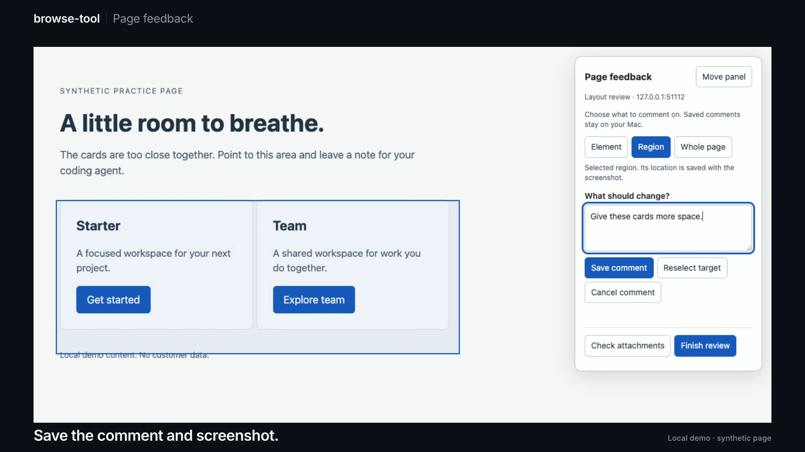

# browse-tool


Browser automation and page feedback for coding agents. Small shell commands navigate Chrome, inspect pages, capture screenshots, and extract content. The Page Feedback extension lets you point at a page and leave comments your agent can read from local files.

## Page Feedback

A comment like “give these cards more space” needs a target. Page Feedback saves the comment with the page URL, selected element or region, and an original screenshot. Your agent can inspect that context instead of guessing which part of the page you meant.

[Watch the demo](videos/page-feedback/demo.mp4) · [Set up the extension](#chrome-extension) · [Use the CLI](#browse-feedback)

[](videos/page-feedback/demo.mp4)

Choose an **Element**, draw a **Region**, or comment on the **Whole page**. Save the note, then give Codex or Claude Code the local feedback launcher and review name. The agent can read comments, open their screenshots, and mark them resolved after checking a fix.

The extension works in your everyday Chrome profile. It needs no debugging port, separate desktop app, or always-running server. Chrome starts a small native helper only when needed. MCP is optional; the CLI is the simplest handoff.

The current extension setup is for **macOS, Google Chrome, and Node.js 20+**. It is loaded unpacked, not installed from the Chrome Web Store. The demo uses a synthetic practice page.

Inspired by Mario Zechner's [What if you don't need MCP at all?](https://mariozechner.at/posts/2025-11-02-what-if-you-dont-need-mcp/).

## Why not MCP?

- Playwright MCP ≈ 13.7k tokens of tool schema, always loaded.
- Chrome DevTools MCP ≈ 18.0k tokens.
- browse-tool: zero tokens up front. This README is read on demand, usually only the entry for the command at hand.
- Outputs pipe, save, and compose with ordinary shell tools.
- Adding a command is a single file — no protocol, no rebuild, no restart.

## When to use browser-box instead

browse-tool drives Chrome on your Mac. That gives two modes, and a signed-in app
you are trying to *act* inside often fits neither.

| | what it is | the catch |
|---|---|---|
| `browse-start --headless` | no display at all | some sites silently no-op |
| `browse-start` (default) | real window, your screen | owns your screen for the whole run |
| `browser-box start` | real window, virtual display, in a container | needs Docker |

**Headless can fail without failing.** Measured on Facebook: menus, mention
typeaheads and file choosers do nothing under `--headless=new` — ordinary buttons
still work, menu items don't, and nothing raises. The script reports success and
posted nothing. Headless Chrome also puts `Headless` in its User-Agent, which the
site can read; browser-box asserts that token is absent on every start.

**Headed costs you the machine.** A visible Chrome takes focus and screen for as
long as the job runs, so any long automation is mutually exclusive with using your
own computer.

[browser-box](browser-box/) ships in this repo for that reason: real headed Chrome on an Xvfb
virtual display inside a container. Chrome composites into a genuine X server, so it
behaves like a desktop browser, and that server is attached to no monitor and no
host. `browser-box view` opens the live screen in a tab when you want to watch or
sign in.

It lives here rather than in its own repo because it writes the same state file
this tool reads — `$TMPDIR/browse-tool-state-<port>.json`, a private format. Split
across two repos, a change to that file breaks the other side silently and no test
catches it. Bundled, it is one change. Docker is required only if you use it;
nothing else in this repo depends on it.

Every browser command works against a running box unchanged:

```bash
browser-box start --profile social      # CDP on 9400
BROWSE_PORT=9400 browse-nav "https://example.com"
BROWSE_PORT=9400 browse-eval 'return document.title'
```

**The split in one line.** Reach for browse-tool to *read* a page — navigate, scrape,
screenshot, crawl, check a selector. Reach for browser-box to *act* inside a
logged-in app that resists automation, or for any job long enough that you want your
screen back while it runs. A LinkedIn publisher built on this pair uses browser-box
for the second reason, and its composer is the shape that argues for the first: a
Quill editor that leaves the Post button disabled unless the text arrives as real
keystrokes, followed by a wait for the link preview to attach.

## Requirements

- Node.js ≥ 20
- Chrome for Testing for the browser automation commands, installed once into `~/.browse-tool/chrome` (see below). On macOS,
  browse-tool requires it so its browsers never share an app identity with your normal
  Chrome — see "Why Chrome for Testing" under Notes. It refuses to fall back silently;
  `CHROME_PATH` is an explicit override only.

  ```
  mkdir -p ~/.browse-tool/chrome && cd ~/.browse-tool/chrome \
    && npx @puppeteer/browsers install chrome@stable
  ```

  It does not self-update. Re-run that command to upgrade; browse-tool picks the newest
  version present.
- Docker, **only** if you use the bundled [browser-box](browser-box/) — see "When to use
  browser-box instead". Nothing else in this repo needs it.

## Install

```bash
git clone https://github.com/nino-chavez/browse-tool.git
cd browse-tool
npm install
```

Put the bins on your PATH — in `~/.zshrc`:

```bash
export PATH="$HOME/path/to/browse-tool/bin:$PATH"
```

Or launch Claude Code with the bins on PATH for one session (run from the repo root):

```bash
alias cl='PATH=$PWD/bin:$PATH claude'
```

Then `/add-dir <path-to-browse-tool>` in Claude Code so the agent can `@README.md` for reference.

## How it works


`browse-start` launches one long-lived Chrome with remote debugging on `:9222` and records it in `$TMPDIR/browse-tool-state-<port>.json`. Every other browser command is a thin client: it reads the state file for its port (`BROWSE_PORT`, else 9222), connects to the same browser, and drives its own leased tab. Navigation, evaluation, screenshots, scraping, and event streams all share one persistent browser and one logged-in profile, while parallel sessions stay off each other's tabs. `browse-stop` kills the browser and clears the state.

## Commands

Browser commands connect to the Chrome that `browse-start` launched (see [How it works](#how-it-works)). `browse-feedback` reads local files and needs no browser connection.

### browse-start

    browse-start [--profile] [--profile-name <name>] [--reseed] [--headless] [--port 9222]

Launch Chrome with remote debugging. Profiles live persistently under `~/.browse-tool/profiles/<name>` so your logged-in state survives between sessions.

- **Default profile is `shared`** — one profile for every session, on every project. Override with `--profile-name foo` or `BROWSE_PROFILE=foo`.

  This used to default to the basename of the current working directory, which silently turned "where you happened to be" into an identity. Every repo, worktree and audit scratch dir minted its own Chrome profile. That reached 102 profiles / 74 GB, five of which had each separately downloaded the same 4 GB on-device model. Sessions now share one browser and isolate at the **tab** level instead (see *Parallel sessions* below), so logging into a site once covers every project.

  **A separate profile is only warranted for simultaneous distinct authenticated identities on the same origin** — e.g. an admin account and a member account you need signed in at once. For a merely logged-out view, use `BROWSE_INCOGNITO=1` instead; it isolates cookies in a BrowserContext without a second profile on disk.
- **`--profile`** on first run rsyncs your real Chrome default profile into the target directory — **only when the target is empty**. It can carry bookmarks, tabs, preferences, and compatible extensions, but it cannot transfer authenticated web sessions because Chrome for Testing uses a different Keychain identity. Your real Chrome profile is never modified. On subsequent runs the flag is a no-op; the persistent profile is reused as-is.
- **`--reseed`** forces a fresh rsync over an existing profile to refresh non-session browser state. It does not import authenticated sessions from normal Chrome. It is refused on the `shared` profile while other sessions hold live tab leases because reseeding rewrites `Default/` and would change identity underneath them.
- **`--headless`** runs without a visible window.
- **`--profile` cannot transplant a logged-in Facebook session.** Cookies copy fine, but `c_user`/`xs` are bound to the originating profile and Chrome drops them; only `datr` survives. Log into the automation profile directly instead. Chrome 136+ likewise refuses `--remote-debugging-port` on your real default profile, so driving your everyday browser is not an option either.

### Parallel sessions

Independent Claude and Codex sessions all drive **one** Chrome on one profile. Each session gets its own tab, leased by session id (`BROWSE_SESSION` when set, else `CLAUDE_CODE_SESSION_ID` / `CODEX_COMPANION_SESSION_ID`, else the parent pid). Leases are one file per session under `~/.browse-tool/leases/` — deliberately not the shared state file. Every `browse-*` command is a separate process, and concurrent writes to one JSON would be a race.

This matters because the old behaviour picked "whichever page looks active", and two independent processes provably selected the *same* tab — so parallel sessions silently drove each other's browser.

- **Subagents of one session are not separate sessions.** They inherit their parent's `CLAUDE_CODE_SESSION_ID`, so they share one lease and one tab unless each sets its own `BROWSE_SESSION=<agent-slug>` on every command. Measured 2026-09-21 (four parallel subagents, one dev server each): `browse-tabs list` ownership markers were wrong, and one agent's `browse-eval` POST ran in another agent's tab against that agent's dev server. Parallel agents on local dev servers also need a hostname each (`<slug>.localhost:<port>`): cookies are scoped by host, not port, so on bare `localhost` the last agent to sign in is signed in on every port.
- Cookies and logins are shared across sessions (same profile, same default context). That is the point: log in once.
- `BROWSE_INCOGNITO=1` gives the session an isolated BrowserContext — its own cookies and storage, no second profile on disk. A session holds one lease *per isolation mode*, so flipping the flag moves between your normal tab and your incognito tab and back, keeping both. (With a single lease it silently handed back whichever tab already existed — no isolation, no warning.)
- `BROWSE_SHARED_TAB=1` restores the old "active or first page" behaviour, for single-session use or driving a tab you opened by hand.
- `browse-nav --new` opens a tab *and* moves this session's lease onto it, so the following `browse-eval` / `browse-screenshot` reads the page you just navigated.
- `browse-stop` stops **only what holds its target port**, and clears only the leases pointing at that browser.

### Ports: one browser per port, state keyed by port

State lives in `$TMPDIR/browse-tool-state-<port>.json`. The port is a browser's identity everywhere in this tool — `browse-start` refuses a held port, `browse-stop` kills the port's owner — so the record is keyed the same way.

A session on a non-default port must say so on every command. `--port` works on
every command, and `BROWSE_PORT` saves repeating it:

```bash
browse-start --port 9223
export BROWSE_PORT=9223   # browse-start prints this line for you

browse-nav --port 9223 example.com   # or per-command
```

Why it matters: state used to be one global `browse-tool-state.json`, and the most recent `browse-start` anywhere on the machine overwrote it. `browse-stop` in one session then read *another* session's port **and** pid, found that pid legitimately owning that port, and killed it — with nothing to flag. Its own Chrome survived unrecorded, holding a port for the next session to trip over.

A `BROWSE_PORT` or `--port` that does not parse is a hard error, never a fallback to 9222. The default port is a browser other sessions may be using, so silently redirecting a typo there is the worst available response. `--port` with no value is rejected too: it arrives as boolean `true`, and `Number(true)` is a perfectly valid-looking `1`. `--port=9223` and `--port 9223` are equivalent. An exported-but-empty `BROWSE_PORT=` reads as absent, while `--port=` is an error.

Chrome permits one instance per profile. Because every session now defaults to the same `shared` profile, the usual answer to "already running" is to use the browser that exists rather than start a second one:

- If the port is held by a Chrome running **the profile you asked for**, `browse-start` adopts it — records it in state and exits 0. Leaving it unrecorded would strand a live browser with no state entry, and that silently disables the wrong-browser check (it fails open on a null state). Adoption matches on profile, not mode. When the running browser is headless and you asked for headed (or the reverse), it says so. `--reseed` cannot be satisfied by adoption and is refused with a non-zero exit rather than reported as done.
- If the port is held by a **different** profile, it refuses and names the squatter.
- If the profile is open but on another port, it reads Chrome's `SingletonLock`, names the holding pid, and prints the `BROWSE_PORT` to use.

**Port ownership is verified, not assumed.** `browse-start` refuses to start when
something it does not track already holds the debugging port, and names the
squatter's pid and profile. After launching, it confirms the port belongs to the
Chrome it just spawned. `browse-eval` and friends refuse to connect when the
port's owner is not the tracked pid. Fail-open: if `lsof` cannot answer, the
checks are skipped rather than blocking work.

Why this exists: the old code only checked that the recorded pid was *alive*,
never that it owned the port. A headless orphan from a finished session could
hold `9222` while `browse-start` reported success for a different profile.
Every subsequent command — navigation, screenshots, cookie reads — then ran
against the orphan and succeeded. On 2026-08-02 that produced four false
"logged out" readings and cost an 8.4 GB profile clone deleted on a false
negative. A silent wrong-browser failure is worse than a loud refusal.

### browse-stop

    browse-stop [--port <n>] [--force]

Kill whatever holds the debugging port, then clear the state and the leases for
that browser. Exits non-zero if anything is still listening afterwards. Killing
only the tracked pid is how orphans accumulated. The kill failed with `ESRCH`,
the state file was deleted anyway, and a live headless Chrome kept the port for
the next session to trip over.

**Refuses while other sessions hold live leases on that browser.** A shared
browser is meant to outlive any one session, and this is the largest blast radius
in the tool — stopping it closes every session's tabs. `--force` overrides.

A lease records the port it belongs to. One written before that field existed is
attributed by asking the browser, over `/json/list`, whether it actually holds
that lease's tab — an exact answer rather than a guess. Only when the browser
cannot be asked does the lease count as a possible match and block. Both halves
matter. An earlier version compared ports exactly, matched none of the eight
live legacy leases, and killed the browser they were all using. The version
after it blocked on every port for the twelve hours until those leases went
stale.

Presence is decided by `lsof` **or** a `/json/version` probe, not `lsof` alone.
`portOwners()` returns an empty list both for "nothing is listening" and for
"could not determine", and it is deliberately fail-open so it never blocks
ordinary work. Gating a destructive guard on that alone points the fail-open
the wrong way. The probe checks for the DevTools payload, not just HTTP 200, so
an unrelated server on the port is not mistaken for a browser.

The probe does **not** cover the window where a Chrome has spawned but is not
yet listening. A TCP connect is refused then, so the probe reports absent
exactly as `lsof` does. That window is handled structurally instead: **leases
are cleared only after the port is confirmed released**, never merely because a
`SIGTERM` was sent. A signal accepted but not acted on within the grace period (hung renderer,
a modal blocking shutdown) leaves every lease intact and exits non-zero.

When nothing was stopped, only *your own* lease **for that port** is cleared —
not your leases generally. A `browse-stop --port 9333` that finds nothing must
not delete your live 9222 lease and orphan the tab you are working in.

If a browser answers but no owning process can be identified, nothing is stopped
and the run exits non-zero. `--force` does not help there — it overrides the
live-session guard, not the absence of a pid to signal.

### browse-nav

    browse-nav <url> [--new] [--wait]

Navigate the active tab (or a new one with `--new`). `https://` is auto-prepended if the URL has no scheme. `--wait` waits for `networkidle2` instead of `domcontentloaded`. Prints final URL and title.

### browse-tabs

    browse-tabs [list | close <index|target-id> [--force]]

List open tabs with their URL/title, or close one. `list` shows a short target id and marks ownership: `*` this session's tab, `~` another session's, blank unclaimed. `close` accepts a target id (or unique prefix) as well as an index. Prefer the id: it is stable, whereas indices renumber when any session opens or closes a tab between your `list` and your `close`. Closing a tab held by another live session is refused unless you pass `--force`.

### browse-eval

    browse-eval '<js>'
    browse-eval --file script.js
    echo '<js>' | browse-eval --stdin

Run JavaScript in the active page. Code is wrapped in `async () => { … }`, so use `return` for a value and `await` freely. Result is JSON-serialized to stdout. Prefer writing scripts to files for anything non-trivial.

Examples:
```bash
browse-eval 'return document.title'
browse-eval 'return [...document.querySelectorAll("h2")].map(h => h.innerText)'
browse-eval 'const r = await fetch("/api/me"); return r.status'
```

### browse-screenshot

    browse-screenshot [--full] [--out path.png]

Capture the viewport (or full page with `--full`) as PNG. Prints the path so you can `Read` it.

### browse-shot

    browse-shot <url> [--out path.png] [--full] [--wait] [--wait-ms <n>] [--wait-for <selector>]

Navigate to URL, wait for readiness, optionally wait for a selector or additional time, then screenshot in one command. Replaces the `browse-nav && sleep N && browse-screenshot` pattern. Prints the output path.

### browse-markdown

    browse-markdown <url> [--wait] [--wait-ms <n>] [--wait-for <selector>] [--raw]

Navigate to URL, strip nav/ads/boilerplate with Readability, convert the main content to markdown with Turndown. Prints `# title` + markdown body to stdout. Falls back to the full page body if Readability finds no article-shaped content (dashboards, SPAs, listings). `--raw` skips Readability entirely and always converts the full body. For clean, LLM-ready text from an article/blog/docs page, use this instead of `browse-eval 'return document.body.innerText'`.

### browse-crawl

    browse-crawl <start-url> [--depth N] [--include prefix] [--max N] [--out dir] [--wait]

BFS crawl from `start-url`, writing each visited page as clean markdown (Readability + Turndown, same extraction as `browse-markdown`).

- Follows same-origin links; `--include prefix` narrows which links are followed.
- `--depth` (default `1`): the start page plus its direct links. `--max` (default `20`) caps total pages.
- `--out dir` (default a fresh temp dir) receives one markdown file per page, plus a `manifest.json` listing `{url, title, file}` for every page.
- Prints each file path to stdout as it's written; the final page count and output dir go to stderr.
- Visited URLs are deduped (fragment-stripped) so it never re-fetches a page.

### browse-events

    browse-events [<Domain.event> | '<Domain.*>' ...] [--console] [--network] [--duration <sec>] [--count <n>] [--out <file>]

Stream Chrome DevTools Protocol events from this session's tab as JSON lines (`{ts, event, params}`), one per line, to stdout or appended to `--out`. Use it to watch what a page actually does — console output, failing requests, navigation — while other commands (or a human) drive it.

- **`--console`** subscribes to `Runtime.consoleAPICalled`, `Runtime.exceptionThrown`, `Log.entryAdded`. **`--network`** to `Network.requestWillBeSent`, `Network.responseReceived`, `Network.loadingFailed`. With no events named you get both presets.
- Positional names subscribe to exact events (`Page.loadEventFired`) or a whole domain (`'Page.*'` — quote it, or the shell globs it). The needed `<Domain>.enable` calls are sent automatically.
- Runs until Ctrl-C by default; `--duration <sec>` or `--count <n>` bounds the run for scripted use. Typical agent pattern: start it in the background with `--out`, drive the page, then read the file.

```bash
browse-events --network --duration 15 --out /tmp/net.jsonl &
browse-nav https://example.com --wait
browse-eval 'document.querySelector("#checkout").click()'
wait; grep loadingFailed /tmp/net.jsonl
```

### browse-cdp

    browse-cdp <Domain.method> ['<json-params>'] [--browser]

Raw CDP passthrough: send any protocol method to this session's tab and print the JSON result. The escape hatch for anything the task-level commands don't cover — including methods Chrome shipped after this tool was written. `--browser` targets the browser instead of the tab (for `Target.*`, `Browser.*`, `SystemInfo.*`).

```bash
browse-cdp Emulation.setCPUThrottlingRate '{"rate": 4}'
browse-cdp Network.emulateNetworkConditions '{"offline": false, "latency": 200, "downloadThroughput": 100000, "uploadThroughput": 50000}'
browse-cdp Browser.getVersion --browser
```

Prefer the task commands when one fits — `browse-eval` over `Runtime.evaluate`, `browse-screenshot` over `Page.captureScreenshot` (which dumps base64 to stdout). They cost fewer tokens per call and handle output sensibly.

### browse-pick

    browse-pick [--port N]
    browse-pick --annotate [--out directory | --resume directory] [--port N]

Enable an interactive element picker in the active tab. Hover highlights elements, click to pick, Cmd/Ctrl+click to add multiple, Enter to finish, Esc to cancel. Returns JSON with tag, id, class, text, html, bounding rect, and a heuristic selector for each picked element. Use this when you need the human to point at something instead of guessing at selectors.

With `--annotate`, leave comments on elements, drawn regions, or the whole page. Each saved comment includes an original viewport screenshot and page context.

- `--out directory`: create a new feedback directory. Existing directories are refused. Defaults to a unique directory under `.browse-feedback/` in the current project.
- `--resume directory`: reopen a saved batch, add comments, and mark comments resolved or reopen them.
- `--port N`: use the same browser port as the other commands. The calling session's tab lease still applies.
- **Save comment** writes immediately. **Finish review** prints the absolute path to `feedback.md` for handoff to your agent. Ctrl+C keeps saved comments.
- `feedback.json` holds exact comments, URLs, viewport size, scroll position, element details, status, and screenshot paths. `feedback.md` is the readable copy.
- **Check attachments** flags missing, ambiguous, or changed elements as stale. A match checks markup and text; it does not prove visual correctness.
- Region and whole-page comments refer to their original screenshots. Comments from other URLs remain unverified until that URL is open.
- Screenshots include visible page content. Output stays local; share the feedback directory only when you intend to share that content.

Use a visible browser window. Choose **Element**, then click a target; choose **Region**, then drag a box; or choose **Whole page**. Add your comment and save it. **Move panel** exposes content behind the panel. Escape cancels the current draft.

Saved comments survive reloads. Unsaved drafts do not. This first version selects elements in the top document; use region comments for canvas or iframe content. It does not launch agents or send messages to desktop apps.

```bash
browse-pick --annotate --out ./review-feedback
browse-pick --annotate --resume ./review-feedback
```

The browser tests use Node's built-in runner and the existing Puppeteer dependency. They open their own test tab in the running browser:

```bash
npm run test:annotations
```

### browse-feedback

    browse-feedback list --root directory
    browse-feedback read --root directory --batch ID [--offset N] [--limit N]
    browse-feedback screenshot --root directory --batch ID --id ID --out file.png
    browse-feedback status --root directory --batch ID --id ID --status open|resolved

Read page feedback and update its status from Codex or Claude Code shell tools. No MCP connection is needed.

- `--root directory`: the local feedback inbox shared with the extension. Batch directories sit directly inside it.
- `--batch ID`: a directory ID returned by `list`. Paths outside the inbox and linked directories are refused.
- `--offset N`, `--limit N`: page through batches or comments. Follow `nextOffset` until it is null; the maximum page size is 20.
- `--id ID`: the comment ID returned by `read`.
- `--out file.png`: copy an original screenshot for inspection. Existing files are refused.
- `--status open|resolved`: update status without changing the comment or screenshot. Verify the rendered result before resolving feedback.

### Chrome extension

    node scripts/prepare-feedback.mjs --out package-directory --root feedback-directory

Install from a stable checkout. The generated launchers reference its absolute path and your current Node executable.

```bash
git clone https://github.com/nino-chavez/browse-tool.git
cd browse-tool
npm ci --omit=optional
node scripts/prepare-feedback.mjs \
  --out .page-feedback \
  --root "$HOME/Documents/Page Feedback"
./.page-feedback/install-native-host
```

If you already cloned browse-tool, run `git pull --ff-only` there and start with `npm ci --omit=optional`.

1. Open `chrome://extensions` in the Chrome profile where you want to annotate.
2. Turn on **Developer mode**, select **Load unpacked**, and choose `browse-tool/.page-feedback/chrome-extension`.
3. Pin **Page Feedback** from Chrome's Extensions menu. Open an HTTP or HTTPS page and click the extension.
4. Start a named review. Choose **Element**, **Region**, or **Whole page**, add a comment, and select **Save comment**.
5. Run `./.page-feedback/feedback list` from the checkout to confirm the review reached your local inbox.

Give your agent this prompt, replacing the checkout path and review name:

```text
Use /absolute/path/to/browse-tool/.page-feedback/feedback to review "Homepage spacing".
Run the launcher with `list`, find that review's batchId, then run `read --batch ID`.
Open the saved screenshots with `screenshot --batch ID --id COMMENT_ID --out NEW_FILE.png`.
Follow nextOffset if the results have another page.
Use the comments and page context to make the requested changes in this project.
Verify the result in the browser before using `status --batch ID --id COMMENT_ID --status resolved`.
```

The agent needs access to the local checkout and feedback inbox. Codex and Claude Code can call the launcher through their shell tools. The extension does not send prompts to open conversations or start coding sessions.

- **Local storage:** comments, Markdown, and screenshots stay in your chosen inbox. Screenshots capture the visible viewport, including page content; “Whole page” describes the comment target, not a full-page scrolling capture.
- **Browser permissions:** the extension requests `activeTab`, scripting, storage, and native messaging. It has no persistent access to every website.
- **Reloads:** saved reviews reopen on same-origin reloads. Invoke the extension again after switching origins. Saved reviews remain after Chrome closes; unsaved drafts do not survive reloads.
- **Selection limits:** element selection covers the top document. Use Region for canvas or iframe content. If the page moves before save, **Reselect target** keeps your typed comment.
- **Install location:** the helper runs from `~/Library/Application Support/Page Feedback`. The installer registers it in Chrome's normal macOS native-host directory and refuses a conflicting installation.
- **Updates:** pull the repo, reinstall dependencies, rerun the prepare command with the same paths, reload Page Feedback in `chrome://extensions`, then refresh the page. Keep the checkout and Node executable in place; moving them requires updating the existing native-host installation.

The extension reuses the same annotation panel as `browse-pick --annotate`. Only the browser automation commands require Chrome for Testing; this extension setup uses your everyday Google Chrome.

### Optional MCP adapter

    node bin/feedback-mcp --root feedback-directory

Expose `list_feedback`, `read_feedback`, `read_feedback_screenshot`, and `set_feedback_status` through a standard local MCP connection. The prepared package includes Codex TOML and Claude JSON examples. Merge the relevant entry into your existing configuration; do not replace the entire configuration file.

MCP is optional. Use `npm install --omit=optional` for CLI and extension use without the MCP SDK. A connected MCP server runs as a local process owned by its client. It does not send prompts into open conversations or start coding sessions.

```bash
npm ci # Include the optional SDK to test the MCP adapter too.
npm run test:feedback
# Uses the existing automation browser; temporarily installs and removes the test extension and native host.
BROWSE_PORT=9339 npm run test:extension
```

## Recipes

**Scrape headlines:**
```bash
browse-start
browse-nav https://news.ycombinator.com
browse-eval 'return [...document.querySelectorAll(".titleline > a")].slice(0,10).map(a => ({title: a.innerText, url: a.href}))'
```

**Check a dev server and screenshot it:**
```bash
browse-start
browse-nav http://localhost:5173 --wait
browse-screenshot --out /tmp/home.png
browse-eval 'return document.querySelectorAll("[data-testid]").length'
```

**Form a selector with human help:**
```bash
browse-pick  # human clicks the element in Chrome
```

**Bigger, project-specific scripts:** `examples/` holds standalone scripts built on `lib/connect.js` directly (bypassing the `bin/` commands) for cases too specific to generalize. E.g. `examples/rally-audit.mjs`, a one-pass route auditor for a particular project's dev server (hardcoded routes/slugs/viewport). Not installed on PATH; run with `node examples/<script>.mjs` after `browse-start`.

**Read an article as clean markdown:**
```bash
browse-start
browse-markdown https://example.com/blog/some-post > /tmp/post.md
```

**Crawl a small docs site (depth-limited, same-origin):**
```bash
browse-start
browse-crawl https://example.com/docs --depth 2 --max 30 --out /tmp/docs-crawl
cat /tmp/docs-crawl/manifest.json
```

## State & troubleshooting

- State file: `$TMPDIR/browse-tool-state-<port>.json` (port from `BROWSE_PORT`, else 9222)
- Tab leases: `~/.browse-tool/leases/<session>.json`, plus `<session>.incognito.json` when `BROWSE_INCOGNITO=1`
- If `browse-nav` says "Cannot connect", run `browse-start`.
- browse-tool launches from its own persistent `--user-data-dir`, so it never touches your real Chrome profile directly. Keep the profile named `shared` for long-lived authenticated QA sessions.
- Override Chrome path with `CHROME_PATH=/path/to/chrome`.
- **Why Chrome for Testing.** macOS identifies an app by the bundle it launched from, so a
  Chrome spawned out of `/Applications/Google Chrome.app` registers as `com.google.Chrome` —
  your browser's identity. LaunchServices then cannot tell them apart, and clicking Chrome in
  the Dock activates whichever instance it finds. When that is one of these boxes, the click
  lands on a process with no window and no way to make one, so your browser looks frozen while
  nothing is wrong with it. Measured 2026-08-14: two boxes registered as `com.google.Chrome`,
  one as `type="Foreground"`, and the Dock had been activating it for seven hours. Chrome for
  Testing is `com.google.chrome.for.testing`, so the collision cannot happen.

  browse-tool now refuses to start on macOS when Chrome for Testing is missing. Set
  `CHROME_PATH` only as an explicit, temporary exception; using `/Applications` Chrome can
  still reintroduce the collision.

- **One-time cost when switching an existing profile.** Chrome keys its cookies to a Keychain
  entry named after the build: `Chrome Safe Storage` for yours, `Chromium Safe Storage` for
  Chrome for Testing. A profile written by `/Applications` Chrome cannot be decrypted by this
  binary, and Chrome deletes cookies it cannot read — verified on a copy, 75 cookies in and 0
  out. Copying a personal profile can preserve bookmarks, tabs, and preferences, but it cannot
  transfer authenticated Gmail, BigCommerce, or other web sessions. Sign in once in the
  `shared` Chrome-for-Testing profile; its own cookies then persist across restarts. Do not copy
  `<profile>/Default/Cookies` as a workaround: those cookies remain encrypted for the source
  browser identity.
